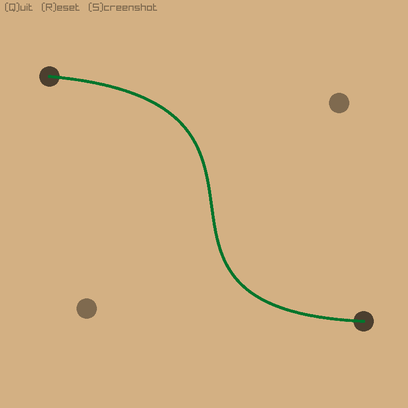

# Bezier Curve Visualization

This is a simple visualizer for Bezier curves built using the Raylib library allowing for manipulation of points to dynamically update the curve on the screen.



## Prerequisites

- [Raylib](https://github.com/raysan5/raylib#build-and-installation).
- g++ (MinGW if you are on Windows)

## Installation

To get started with this project, clone the repository and compile the project using the provided `Makefile`.

```bash
git clone https://github.com/ikugox/simple-bezier-curves.git
cd simple-bezier-curves
make
```
### ⚠️ **Warning for Windows users**
You need to have MinGW with g++ if you want to compile it.

## Running the Project

Once compiled, run the project with `./simple_bezier`

or double click `simple_bezier.exe` if you are on Windows.

## How to Use

- **Left-click**: Move an existing control point.
- **Right-click**: Add a new control point or remove an existing one.
- **R**: Remove all control points.
- **S**: Screenshot the program window.
- **Q**: Quit the program.
